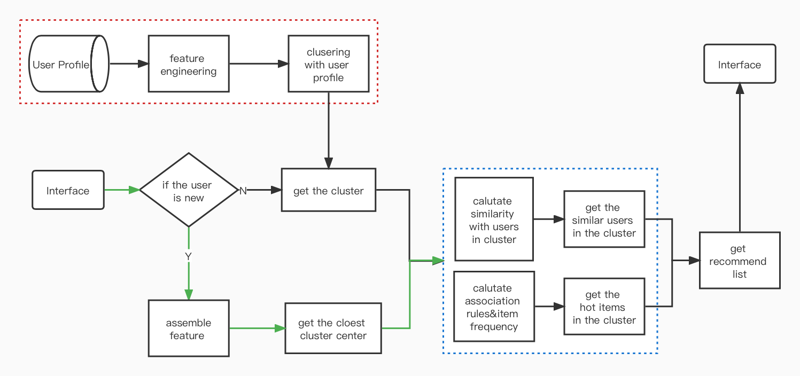

# <center>A fast recall strategy based on clustering centers for a startup in a recommendation system</center>

<center>
<strong>Yiqing Hu</strong>
<br>Faculty of Economic Sciences, University of Warsaw, Warsaw, Poland
</center>
<br>

**Abstract:** Startup recommendation for new users without 
any behavior data is always a challenge for the recommendation system. 
We can use several advanced algorithms or strategies to deal with 
the startup in real production. However, in this course, we do not 
have so many tools in the box we discussed in class. Using the k-means 
to cluster old users to get centers, and getting the center with a 
minimum distance from the new user is the feasible solution to 
fulfill our final course task. The clustering center from k-means
delivers the new user recommend list which produced by Apriori. 
PCA reduces the dimensions of user features and assists to
determine the number of k in k-means. 
<br>**Key Words:** K-means, PCA, Apriori, Recommendation System

## 0. Structure
In the chapter Algorithms, we will discuss these three algorithms and 
implement them by code. We will explore the data we use in this paper 
in the chapter on Data. Chapter Clustering shows the analytic process 
and results of getting the centers, which will conclude PCA and 
k-means. Chapter Recommendation discusses how we get the recommend
list using Apriori, and how we combine cluster centers and recommend
lists together to recommend for the new. The Presentation chapter 
is a simple data analysis website I built to explore data visually. 
And we have a Conclusion in the last chapter.

For the unsupervised learning course, I will use PCA and K-means in chapter 
Clustering and Apriori in chapter Recommendation. Because it is not convenient
to seprate one for R coding. So I add R code to analysis in chapter Data.

## 1. Algorithms
In this chapter, we will quickly review k-means, PCA, and Apriori algorithms.
### 1.1 K-mean
The k-means clustering implementation contains 4 steps:
1. Selecting the number of clusters. In my previous work 
dealing with user data that has more than 400,000 DAU. 
It is hard to determine that number, so we usually start this
algorithm with the K of Sqrt(n/2) or use the information 
within the user data like address, hobby, and so on. 
Gap statistics and the Silhouette Coefficient are sometimes used, 
but these cost a lot of time. In a Big Data environment, determining 
the number of K is very important, because it really costs our machine 
to calculate the distance from a node to every k center.
2. Calculating the distance between the vectors of two nodes.  
3. Calculating the new centers by mean.
4. Repeat steps 2 and 3 until getting the maximum number of iterates or
reaching the min error.

Following the steps of k-means, we can easily implement the algorithm with code. There is a snapshot of the python code 
with comments on k-means I wrote below:
```python
import numpy as np
n = 100
x = np.arange(100)
y = np.arange(200, 300, 1)

# 1、set the number of clusters,  chose k (0,0) and (1,1) as the initial center just for demo
k = 2
center0 = np.array([x[0], y[0]])
center1 = np.array([x[1], y[1]])
dist = np.zeros([n, k + 1])  # initialize the distance maxtrix which is just for demo

_iter = 0
_err = None
while _iter<20:
    # 2、using Euclidean to calculate the distance of vectors between two point
    for i in range(n):
        dist[i, 0] = np.sqrt((x[i] - center0[0]) ** 2 + (y[i] - center0[1]) ** 2)
        dist[i, 1] = np.sqrt((x[i] - center1[0]) ** 2 + (y[i] - center1[1]) ** 2)

        # 3、using the calculated distance to decide which cluster the point belong to
        if dist[i, 0] <= dist[i, 1]:
            dist[i, 2] = 0
        else:
            dist[i, 2] = 1

    # 4、calculating the center of clusters

    # 4.1、initializing index
    index0 = dist[:, 2] == 0  # 所有行的第三列为0
    index1 = dist[:, 2] == 1  # 所有行的第三列为1

    # 4.2 using mean to re-index
    center0_new = np.array([x[index0].mean(), y[index0].mean()])
    center1_new = np.array([x[index1].mean(), y[index1].mean()])

    # 5、updating the new center of clusters
    if (center0 == center0_new).all() and (center1 == center1_new).all():
        break
    else:
        center0 = center0_new
        center1 = center1_new
    _iter += 1

print(center0, center1)
print(dist)
```
The result is below. The first print
[ 24.5 224.5] [ 74.5 274.5] are the coordinates of the two centers. 
The second print is the matrix of nodes with the center label which 
is on the third column in which 0 represents the center of 
[ 24.5 224.5] and 1 represents [ 74.5 274.5].

```
[ 24.5 224.5] [ 74.5 274.5]
[[ 34.64823228 105.3589104    0.        ]
 [ 33.23401872 103.94469683   0.        ]
 [ 31.81980515 102.53048327   0.        ]
 .
 .
 .
 [103.94469683  33.23401872   1.        ]
 [105.3589104   34.64823228   1.        ]]
```
## 1.2 PCA
The PCA implementation contains mainly 5 steps:
1. Normalizing original data matrix X. 
2. Calculating the covariance matrix D(X) of X.
3. Calculating the eigenvalues and eigenvectors of matrix D(X).
4. orting and Indexing the eigenvalues related to the original vector.
5. Getting the top k important vectors.

Following the steps of PCA, we can use the package of NumPy to implement the algorithm. There is a snapshot 
of the python code with comments on PCA I wrote below:
```python
def my_pca(array):
    # calculate the cov-variance matrix of the array
    cov = np.cov(array, rowvar=False)

    # calculate the eigenmatrix,
    # each column in the matrix is the eigenvector
    eig = np.linalg.eig(cov)

    # get the components and variance_ratio
    components = eig[1]
    vars = eig[0]
    explained_variance_ratio = vars/sum(vars)
    print(explained_variance_ratio)

    # calculate standard variance to get eigenvalue
    sds = np.sqrt(vars)
    eigenvalues = components * sds

    # sorting and decreasing eigenvalue
    sorted_eig_val = eigenvalues[:, np.argsort(-vars)].T
    return sorted_eig_val, explained_variance_ratio

# use PCA in the pkg of scikit-learn
pca = PCA()
pca.fit(mtx)
pca_ratio = pca.explained_variance_ratio_

print('Component importance of PCA in scikit-learn')
print(pca_ratio)
print('')
print('Component importance of My PCA')
my_pca(mtx)[1]
```
Comparing the results of the snapshot below from PCA of my code with NumPy and 
PCA in scikit-learn, we can notice that the variance ratio is the same proving 
our code works.

```
Component importance of PCA in scikit-learn
[4.25200900e-01 1.77231437e-01 1.24532921e-01 7.31860858e-02
 6.93467514e-02 5.38007297e-02 4.12972825e-02 2.58732153e-02
 9.52265378e-03 8.02349649e-06]

Component importance of My PCA
[4.25200900e-01 1.77231437e-01 1.24532921e-01 7.31860858e-02
 6.93467514e-02 5.38007297e-02 4.12972825e-02 2.58732153e-02
 9.52265378e-03 8.02349649e-06]
```
## 1.3 Apriori

Apriori<a href="#ref_1">[1]</a> is one of the algorithms of association analysis which is the 
task of finding relationships in large-scale datasets. These relationships 
can take two forms: (1) frequent item sets, and (2) association rules.
### 1.3.1 Frequent item sets
**Frequent item set:** It is a collection of items that often appear together.
<br>**Quantification method - Support:** Support is the proportion of records in the 
dataset that contains the item set. For example, in the data set 
[[1, 3, 4], [2, 3, 5], [1, 2, 3], [2, 5]], the support of the item set 
{2} is 3/4, and the item the support of the set {2,3} is 1/2.

### 1.3.2 Association Rules
**Association rules:** Implying that there may be a strong relationship between two items.
<br>**Quantitative calculation - Confidence:** Confidence is defined for an association rule such as {2}-->{3}. {2}-->{3}, 
the reliability of this rule is “support_degree{2, 3}/support_degree{2}”, that is, 2/3, which means 2/3 in all records containing 
{2} in {2,3} with the rules.

### 1.3.3 Principle of Apriori
If an item set is frequent, then all its subsets are also frequent.
Conversely, if an item set is infrequent, then all its supersets are 
also infrequent. Based on these principles, Apriori can avoid the exponential 
growth of the number of item sets, so that frequent item sets can be calculated 
in a reasonable time.

### 1.3.4 Apriori algorithm process
1. First, generate a list C1 of item sets with several 1 based on the data set. 
2. According to the frequent item set function, calculate the support degree of each 
element in C1, remove the elements that do not meet the minimum support degree, and generate the frequent item set list L1 that meets the minimum support degree.
3. Generate a candidate item set list C2 with k=2 based on L1 according to the 
function of creating candidate item sets.
4. According to the frequent item set function, based on C2, generate a frequent 
item set list L2 that satisfies the minimum support degree k=2.
5. Increasing the value of k, repeat 3) and 4) to generate Lk until Lk is empty, 
return the L list, L includes L1, L2, L3…

The sample handwriting Apriori process is below:


## 2. Data 
Use user data and item data are downloaded from the Internet. 
They are both CSVs. In this chapter, we will check the data quickly to 
verify if they are qualified to run the jobs for unsupervised learning.
### 2.1 User Data
User data uses travel reviews data set<a href='#ref_2'>[2]</a>  which is a data set for reviewing destinations in 10 categories mentioned across East Asia. Each traveler rating is mapped as Excellent(4), Very Good(3), Average(2), Poor(1), and Terrible(0) and average rating is used. It is populated by crawling TripAdvisor.com. Reviews on destinations in 10 categories mentioned across East Asia are considered. Each traveler rating is mapped as Excellent (4), Very Good (3), Average (2), Poor (1), and Terrible (0) and the average rating is used against each category per user.

### 2.1.1 Attribute Information
Attribute 1: Unique user ID
<br>Attribute 2: Average user feedback on art galleries 
<br>Attribute 3: Average user feedback on dance clubs 
<br>Attribute 4: Average user feedback on juice bars 
<br>Attribute 5: Average user feedback on restaurants 
<br>Attribute 6: Average user feedback on museums 
<br>Attribute 7: Average user feedback on resorts 
<br>Attribute 8: Average user feedback on parks/picnic spots 
<br>Attribute 9: Average user feedback on beaches 
<br>Attribute 10: Average user feedback on theaters 
<br>Attribute 11: Average user feedback on religious institutions

### 2.1.2 Data statistic
Using python pandas to read the CSV file of the data and check the data. Printing 
the result of function Info() shows there is no Missing value and all data are 
float, not category or character which means feature engineering free.

Function describe() shows all features which are on a similar scale proving there’s no need to 
transform the data. 

Function parirplot() in the python package of seaborn from package seaborn can print the 
correlation figure  between two features. The diagonal is the distribution of the feature itself. 
Feature 4 and feature 7 are not paired so well with other features. We will deal with them in the 
next chapter.


## 2.2 Item Data
Item data uses the groceries dataset<a href="#ref_3">[3]</a> which has 38765 rows of the purchase orders
of people from grocery stores.

### 2.2.1 Attribute Information
Member_number: User ID 
<br>itemDescription: Item name
<br>Date: The data user buys the item

### 2.2.2 Data statistic
Using python pandas to read the CSV file of the data checking the basic 
information such as the number of instances, number of users, number of 
items, and if there are missing values.

## 3. Clustering
In this chapter, we will use PCA to reduce the dimension of 
user data. With the reduced data, we run k-means multi-iterations to calculate 
the silhouette score in each iteration shown by a figure to determine the number 
cluster which is K. Plotting the node with the top 3 components in the 3D figure 
to check if the de-dimensioned K-means works well.

### 3.1 Feature reduction
Using the package PCA() for user data check the components. From the result, 
we can find top 3 components are 0.42, 0.17, and 0.12 respectively which make up 
the vast majority ratio. And Components 8, 9, and 10 can be clipped. 
```python
pca = PCA()
pca.fit(trip_df.values)
n_pcs= pca.components_.shape[0]

pca_ratio = pca.explained_variance_ratio_
print('Component Ratio')
for i, comp in enumerate(pca_ratio):
    print("component_"+str(i+1), "%.5f"%comp)
```
```
Component Ratio
component_1 0.42520
component_2 0.17723
component_3 0.12453
component_4 0.07319
component_5 0.06935
component_6 0.05380
component_7 0.04130
component_8 0.02587
component_9 0.00952
component_10 0.00001
```
It should be emphasized that PCA is not good at feature dropping and selecting. 
Though each component which is an eigenvector contains weights that represent 
the importance of each feature, it is tricky to tell how important the whole 
matrix is. Usually, we can simply use linear regression in a supervised learning 
task to get the features’ weights which determine the output value Y. In this 
paper, we try to use PCA to pick features by the values with the largest 
proportion in each eigenvector. The result of the first line means that feature 
6 with the highest proportion in component 1 is 0.44. 
```python
important_ratio_bottom = []
important_ratio_height = []
feature_acc = [0]*n_pcs
print('\nMost Important Feature in each Component')
for j, i in enumerate(range(n_pcs)):
    component_arr = np.abs(pca.components_[i])
    idx = component_arr.argmax()
    component_ratio = component_arr[idx]/sum(component_arr)
    print('component_'+str(j+1), 'feature_'+str(idx+1), "%.5f"%component_ratio)
    important_ratio_bottom.append(pca_ratio[i]*component_ratio)
    important_ratio_height.append(pca_ratio[i]*(1-component_ratio))
    for k,v in enumerate(component_arr):
        feature_acc[k] += v
```
```
Most Important Feature in each Component
component_1 feature_3 0.44760
component_2 feature_6 0.26113
component_3 feature_2 0.46280
component_4 feature_9 0.49582
component_5 feature_1 0.24801
component_6 feature_10 0.27162
component_7 feature_5 0.22963
component_8 feature_10 0.33426
component_9 feature_8 0.77743
component_10 feature_7 0.97385
```
The figure below combines two results above and directly shows the ratio of
each component and the ratio of the feature value in each component.


Then we plot the figure to show the accumulation of all feature values in the 
whole matrix. Feature 7 and 8 are the least, and they are the most important 
feature for components 9 and 10 having the least ratios. Though the accumulation 
feature 4 is high, feature 4 is not the top-valued feature in each eigenvector. 
In paragraph 2.1.2, we find feature 4 and feature 7 are not paired so well with 
other features. So we decide to drop feature 4, 7, and 8.


## 3.2 K-selecting
We drop feature  4, 7, and 8 to get new data set for training k-means. The 4 
comments in the function of my_kmeans() show how to code and run k-means 
algorithms in the scikit-learn package. We run my_kmeans() with a k number 
from 2 to 20 to calculate the silhouette score for selecting the number of clusters.
```python
pca_df = trip_df.drop(['Category_7','Category_8', 'Category_4'], axis=1)
def my_kmeans(data_df, k):
    # 1. initialize the model
    my_kmeans = KMeans(n_clusters=k, random_state=1)

    # 2. fit the model to the data
    my_kmeans.fit(data_df)

    # 3. obtain cluster labels
    clusters = my_kmeans.predict(data_df)

    # 4. get cluster centers
    centroids = my_kmeans.cluster_centers_
    return clusters, pd.DataFrame(centroids)

sil_score_lst = []
k_lst = list(range(2,20))
for k in k_lst:
    clusters, centroids_df = my_kmeans(pca_df,k)
    if k == 4:
        trip_df['cluster_label'] = clusters
    score = silhouette_score(pca_df, clusters, metric='euclidean')
    sil_score_lst.append(score)
```
When K=2, the silhouette score gets the highest, normally, selecting 2 clusters 
is the best choice.  But our task is the recommendation, too small of the K is 
not good for recommending which will reduce the richness and difference of 
recommendation. When K=4, the score gets sable, so we choose 4 clusters for our 
remaining tasks. Actually, choosing 4-7 are all accepted, only depending on the 
task scene.


After clustering with K=4, we plot the nodes with the top 3 components in the 
3D nodes scatter figure.


Dropping feature 3, 6, and 2 which are the most important features for the top 
3 components will get the silhouette score figure and nodes scatter figure below 
showing the instability of the silhouette score and the implicit result of nodes scatter.


Dropping feature 9,1,10 which are not so important and not so unimportant 
features will get the silhouette score and nodes scatter figure below. The 
results get better than the second one but are not as good as the first 
situation.


Till now, we select 4 clusters with dropped feature 7,8,4 to do the rest job.

The reason why we use PCA to reduce the dimensions is to optimize the cost of 
implement time. Because in real Internet task, it is normal that the number of 
features would be thousands. Dedimension will also improve the situation of 
overfitting for supervised learning. It is quite only for us to check the data by
poltting them on the figure which rely on 2 or 3 dimensions with the PCA components.

## 4. Recommendation
This chapter contains the user recommendation and the item recommendation. 
We will use cluster center getting from k-means to recommend the people to the 
new user who may like which based on the similarity of mental distance 
approaches<a href='#ref_4'>[4]</a>. Item recommendation delivered by Apriori 
recommends new user items they may like. The flow chart below is the whole process
of the strategy to recommend for new user.



The red dotted line box does the work as we discussed in Chapter Clustering.
The green line is for new user to get the data for recommend. 
The blue dotted line box is the recommendation list of the genarate module.

### 4.1 User recommendation
If the recommendation task is for new users, the user profile we use in the red dotted line box
will only choose the features that new users would have, like the brand of mobile phone, ip
address, gender, application installed list(som countries can't get this, because of the law), 
and so on. We can't use the user behavior as the features for clustering as we did in the chapter
clustering, because new user do not have this data.

As the flow chart shows, the interface gets new user basic data, then we assemble the data into
a vector which have the same form as cluster centers we already made. We calculate the similarity
with the vectors of cluster centers to get the closest one, then calculate the similarity with users
in the cluster. We can get a list of similar users to recommend the new one.

### 4.2 Item recommendation
We will use groceries dataset csv as original data to implement this task to recommend.
After grouping the items by users from groceries data, each user gets the list of items he clicked.

```python
groceries_grouped = groceries.groupby('Member_number')['itemDescription']\
    .agg(lambda x: ','.join(x))\
    .reset_index(name ='Item_series')
input_items = list(map(lambda x: tuple(set(x.split(','))),
                       list(groceries_grouped['Item_series'])
                       ))
```
The output below is the result from the code above. It is the examples which we 
will regard as  the input data for apriori
```
input_items sample: 
[('sausage', 'hygiene_articles', 'salty_snack', 'misc._beverages', 'whole_milk', 'pastry', 'canned_beer', 'soda', 'yogurt', 'semi-finished_bread', 'pickled_vegetables'), 
 ('sausage', 'whole_milk', 'soda', 'beef', 'whipped_sour_cream', 'rolls_buns', 'frankfurter', 'white_bread', 'curd'), 
 ('frozen_vegetables', 'whole_milk', 'other_vegetables', 'sugar', 'tropical_fruit', 'butter_milk', 'butter', 'specialty_chocolate')
 ]
```
<br>After we putting the data above into the apriori, and setting the parameters of min_support and min_confidence 
can get the item frequency set and the association rules dictionary.
```python
item_dict, rules4all = apriori(input_items, min_support=0.1, min_confidence=0.11)
reflect_rec = list((map(lambda x: (x.lhs[0],x.rhs[0]),rules4all)))
rules_dict = {}
for tup in reflect_rec:
    if tup[0] not in rules_dict:
        rules_dict[tup[0]] = [tup[1]]
    else:
        rules_dict[tup[0]].append(tup[1])
print('rules_dictionary', rules_dict)
```
We store the dictionary into memory database like Redis. When users click certain item, 
system will access the Redis to get the dictionary for the recommend item below.
```
rules_dictionary
 {'whole_milk': ['bottled_water', 'other_vegetables', 'rolls_buns', 'root_vegetables', 'sausage', 'soda', 'tropical_fruit', 'yogurt'], 
 'bottled_water': ['whole_milk'], 
 'rolls_buns': ['other_vegetables', 'soda', 'whole_milk', 'yogurt'], 
 'other_vegetables': ['rolls_buns', 'soda', 'whole_milk', 'yogurt'], 
 'soda': ['other_vegetables', 'rolls_buns', 'whole_milk'], 
 'yogurt': ['other_vegetables', 'rolls_buns', 'whole_milk'], 
 'root_vegetables': ['whole_milk'], 'sausage': ['whole_milk'], 
 'tropical_fruit': ['whole_milk']
 }
```
<br>In each cluster, we imply the apriori for the recommend list which contains top 10 items. 
As the flow chart at the beginning of this sector, users from interface will check which cluster
he is most similar with, and then get recommend list of this cluster. When he clicks some item having
the association rules, the system can continually push the item recommend.
```python
for k in set(trip_df['cluster_label']):
    tmp_df = trip_df[trip_df['cluster_label'] == k]
    input_items = list(map(lambda x: tuple(set(x.split(','))),
                           list(tmp_df['Item_series'])
                           ))
    # run Apriori
    item_dict, association_rules= apriori(input_items, min_support=0.1, min_confidence=0.15)
    # clean the frequent item sets
    kv_pairs = map(lambda x: (x[0][0], x[1]), item_dict[1].items())
    # order the item sets
    sorted_paired = sorted(kv_pairs, key=lambda kv: -kv[1])
    # get the most 10 frequent items as the recommend list
    rec_lst_top10 = list(map(lambda x: x[0], sorted_paired))[:10]
    print("cluster %d rec lst top10: " % k, rec_lst_top10)
```

```
cluster 0 rec lst top10:  ['whole_milk', 'other_vegetables', 'rolls_buns', 'yogurt', 'soda', 'root_vegetables', 'bottled_water', 'tropical_fruit', 'pastry', 'bottled_beer']
cluster 1 rec lst top10:  ['whole_milk', 'other_vegetables', 'rolls_buns', 'yogurt', 'soda', 'root_vegetables', 'bottled_water', 'tropical_fruit', 'pip_fruit', 'citrus_fruit']
cluster 2 rec lst top10:  ['whole_milk', 'other_vegetables', 'rolls_buns', 'soda', 'yogurt', 'tropical_fruit', 'root_vegetables', 'bottled_water', 'sausage', 'citrus_fruit']
cluster 3 rec lst top10:  ['whole_milk', 'rolls_buns', 'yogurt', 'other_vegetables', 'tropical_fruit', 'soda', 'root_vegetables', 'sausage', 'bottled_water', 'shopping_bags']
```


## 5. Presentation
Data Visualization platform is an important part of recommendation system for Presentation.
The platform can very well help data analysts to carry out their work. We bulid a demo of the 
platform to show the result of unsupervised learning. 
This chapter we will introduce every page of the demo.

### 5.1 Login Page
Managers which are users of platform with different permissions have different scopes of use. 
We divide users into normal managers and super managers.


### 5.2 Algorithm page
This page lists all the subpages we can access for visualization.


### 5.3 PCA Page 1
Two figures could help us to look into the importance of each feature in the whole data 
and within the component.


### 5.4 PCA Page 2
This page shows which is the most important or has the highest ratio feature in the 
component. We can find the feature names from this list.


### 5.5 K-means feature selecting page
In this page, we can choose which feature we want to drop.


### 5.6 K-means result page
Figure 1 in this page shows the silhouette score with different number of clusters. 
Figure 2 scatters the nodes in 3D. The coordinates of the 3D is top 3 important features. 
In this page we can select the features to check if it is the result we want.


### 5.7 Apriori parameter page
Setting the parameters of apriori in this page.


### 5.8 Apriori result page
After setting the parameters, we can get the association rules 
from apriori in this page.


## 6. Conclusion
We combine three paper into one, and add an extra R paper content in this paper.
Hoping it is ok to pass the course. The conclusion is just a formality to
complete for the entire paper. Let's end up here, thank you.

## REFERENCES 
<a id='ref_1'>[1]</a> Rakesh Agrawal and Ramakrishnan Srikant Fast algorithms for mining association rules. Proceedings of the 20th International Conference on Very Large Data Bases, VLDB, pages 487-499, Santiago, Chile, September 1994.

<a id='ref_2'>[2]</a> Shini Renjith, UCI Machine Learning Repository, 19 December 2018. Travel Reviews Data Set. https://archive.ics.uci.edu/ml/datasets/Travel+Reviews

<a id='ref_3'>[3]</a> Heeral Dedhia, Kaggle, 2020. Groceries dataset. https://www.kaggle.com/datasets/heeraldedhia/groceries-dataset.

<a id='ref_4'>[4]</a> Shepard, Roger N. (1962). "The analysis of proximities: Multidimensional scaling with an unknown distance function. I.". Psychometrika. 27 (2): 125–140. doi:10.1007/BF02289630. S2CID 186222646.

